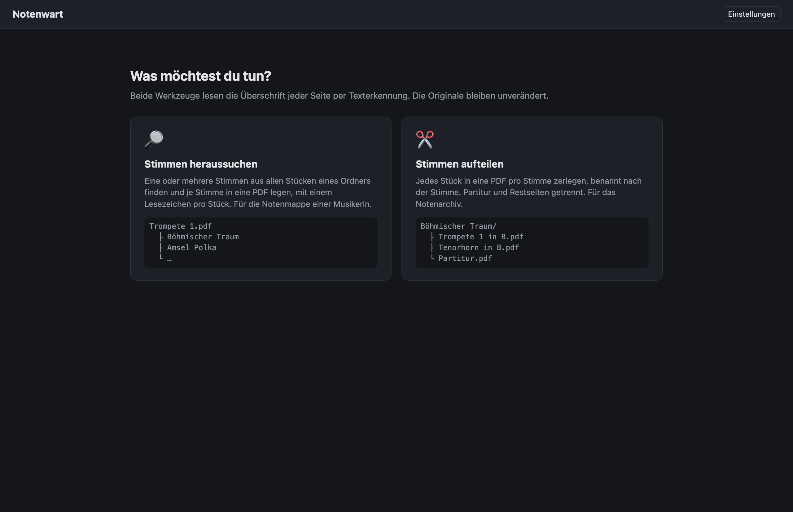
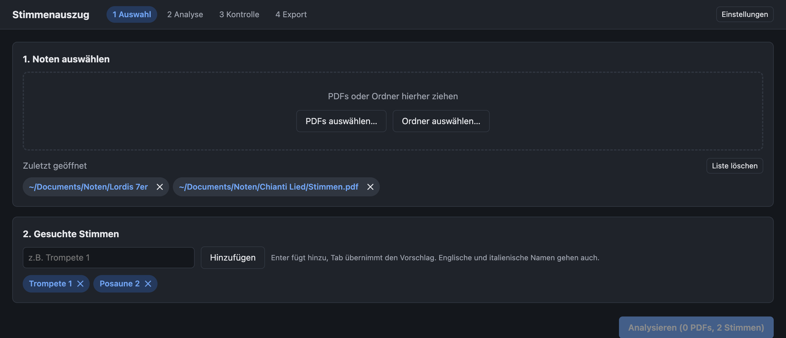
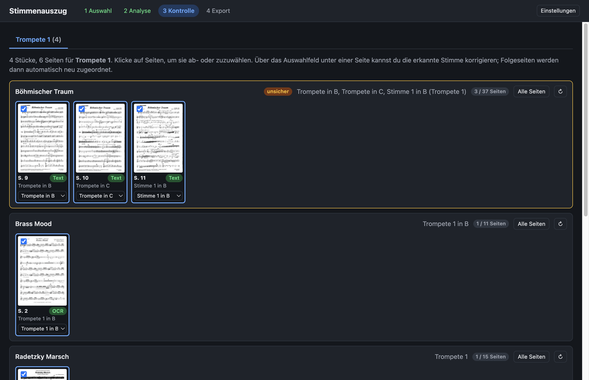
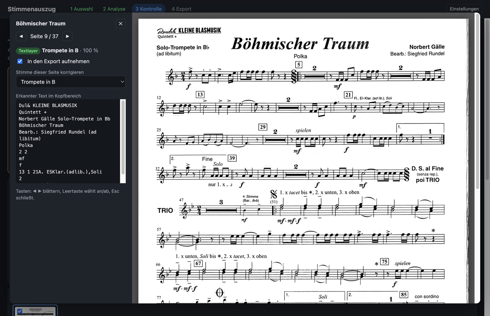
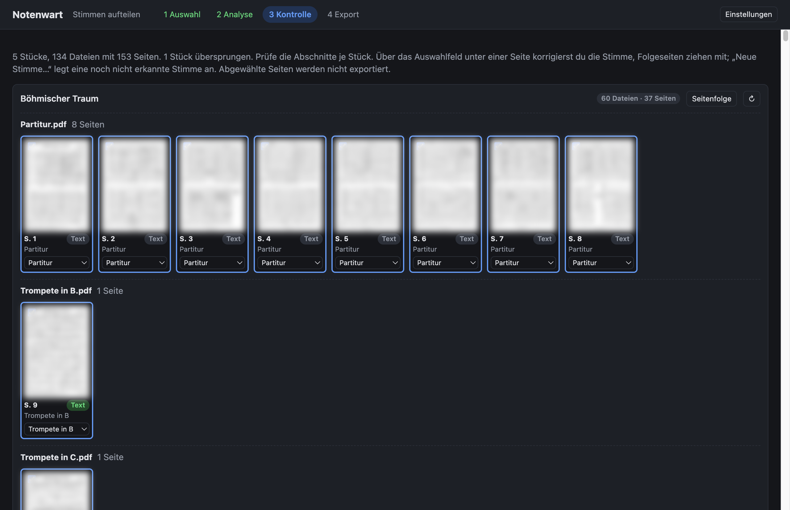

<p align="center">
  
</p>

<h1 align="center">Notenwart</h1>

<p align="center">
  Einzelne Stimmen aus gescannten Noten-PDFs heraussuchen und als eigene PDF exportieren.<br>
  Für Windows und macOS, ohne Installation weiterer Software.
</p>

> **Entstehung:** Diese Software wurde mit KI-Unterstützung (Claude) entwickelt, nach dem Prinzip „KI schreibt, Mensch entscheidet und prüft“. Anforderungen, Architekturentscheidungen, Tests an echten Notenbeständen und jede Abnahme kamen von mir; der Code selbst stammt überwiegend aus dem Dialog mit der KI. Wer das Projekt weiterentwickelt, sollte das beim Lesen im Hinterkopf haben: Die Erkennungsregeln sind an einem konkreten Bestand kalibriert und mit 51 Tests abgesichert, aber nicht jede Zeile wurde von Hand geschrieben.

---

Alltag im Notenarchiv: Ein Ordner voller Stücke als PDF, jedes mit allen Stimmen hintereinander, und die Trompete 1 braucht ihre Mappe. **Notenwart** liest die Überschrift jeder Seite und kann zweierlei: eine Stimme aus allen Stücken heraussuchen und als eine PDF mit Lesezeichen pro Stück ablegen, oder jedes Stück in eine PDF pro Stimme aufteilen. Die Originale bleiben unverändert.

## Was es kann

Zwei Werkzeuge, wählbar auf der Startseite:

- **Stimmen heraussuchen:** Eine oder mehrere Stimmen aus allen Stücken finden, je Stimme eine PDF mit Lesezeichen pro Stück. Für die Notenmappe.
- **Stimmen aufteilen:** Jedes Stück in eine PDF pro Stimme zerlegen, benannt nach der Stimme („Trompete 1 in B.pdf“), pro Stück ein Unterordner. Partiturseiten kommen in „Partitur.pdf“, Seiten ohne erkannte Stimme in „Sonstiges.pdf“. Unterordner des Eingabeordners werden gespiegelt, Dateien, die schon eine Einzelstimme sind, werden übersprungen. Für das Notenarchiv.

Beiden gemeinsam:

- **Gescannte Noten.** Texterkennung (OCR) direkt in der App, Deutsch und Englisch, ohne Cloud. Textlayer werden genutzt, wenn vorhanden.
- **Uneinheitliche Bezeichnungen.** „Trompete 1“, „1. Trompete“, „Trumpet 1“, „Tromba I“, „Trp. 1“, „1st Bb Trumpet“ landen alle beim selben Ergebnis. Eigene Aliase wie „1. Stimme (B)“ → „Trompete 1“ sind möglich.
- **Partituren werden erkannt** und ausgelassen, auch Folgeseiten ohne Überschrift.
- **Folgeseiten** einer Stimme werden bis zur nächsten Überschrift mitgenommen.
- **Doppelbelegungen** wie „4. Stimme in C (Bariton, Posaune 2)“ gelten für alle genannten Stimmen.
- **Kontrolle vor dem Export** mit Miniaturen, Großansicht, Konfidenz und manueller Korrektur.
- **Mehrere Stimmen pro Lauf**, je eine PDF, Lesezeichen pro Stück.
- **Cache.** Erkannte Ergebnisse werden gespeichert, ein zweiter Lauf über denselben Bestand ist sofort fertig.
- **Optionale KI-Erkennung** für schlechte Scans über eine OpenAI-kompatible Schnittstelle (OpenRouter, OpenAI oder lokal mit Ollama). Standardmäßig aus.

## So sieht es aus

**Start:** Werkzeug wählen.



**Auswahl:** Ordner oder Dateien hineinziehen, Stimmen eintragen.



**Kontrolle:** Treffer pro Stück, unsichere Zuordnungen sind markiert, jede Seite lässt sich ab- oder zuwählen und einer anderen Stimme zuordnen.



**Großansicht:** Ein Klick auf eine Miniatur zeigt die Seite in voller Größe mit dem erkannten Text.



**Aufteilen:** Pro Stück die erkannten Abschnitte, jede Zeile wird eine Datei. Hinweise bei unsicheren Seiten, mehrfach vorkommenden Stimmen und Zweitstimmen.



*Die Notenzeilen in den Screenshots sind unkenntlich gemacht. Die gezeigten Noten sind urheberrechtlich geschützte Verlagsausgaben; nur Titel und Stimmenbezeichnung sind sichtbar, um die Funktion zu zeigen.*

## Hinweis zum Urheberrecht

Notenwart verändert oder vervielfältigt keine Noten über das hinaus, was du selbst tust: Es kopiert Seiten aus deinen eigenen PDFs in eine neue Datei. Ob du die Ergebnisse weitergeben darfst, richtet sich nach den Lizenzbedingungen der jeweiligen Verlagsausgabe. Für den Einsatz im Verein gilt üblicherweise: Kopien und Auszüge nur für Stücke, die der Verein rechtmäßig erworben hat, und nur für die eigenen Musikerinnen und Musiker. Im Zweifel beim Verlag oder beim Verband (in Deutschland z.B. über die BDMV-Rahmenverträge mit der GEMA und der VG Musikedition) nachfragen.

## Installation

Fertige Builds liegen unter [Releases](../../releases). Die App ist nicht signiert, deshalb warnen Windows und macOS beim ersten Start einmalig. Die Schritte dazu stehen in [docs/INSTALLATION.md](docs/INSTALLATION.md).

| Plattform | Datei |
|---|---|
| macOS (Apple Silicon) | `Notenwart-<Version>-arm64.dmg` |
| Windows (64 Bit), Installer | `Notenwart-Setup-<Version>.exe` |
| Windows (64 Bit), portabel | `Notenwart-Portable-<Version>.exe` |

## Wie die Erkennung arbeitet

1. **Textlayer** der Seite lesen (oberer Bereich). Reicht das für eine Zuordnung, ist die Seite fertig.
2. Sonst **OCR** des Kopfbereichs mit tesseract.js, in drei Auflösungen, weil 1-Bit-Scans in Originalauflösung schlecht lesbar sind. Ohne Treffer wird die Seite gedreht, für quer eingescannte Blätter.
3. **Klassifikation** über eine Synonymtabelle mit Fehlertoleranz: Instrument, Nummer, Stimmung, Schlüssel. Mehrere verschiedene Stimmen auf einer Seite bedeuten Partitur. Titelwörter („Polka für Trompete“) zählen nicht als Stimme.
4. **Zuordnung** der Seiten zu Abschnitten: Eine Überschrift gilt bis zur nächsten, Partiturseiten unterbrechen.
5. Optional **KI**: Der Kopfbereich wird als Bild an ein Vision-Modell geschickt, nur für unsichere Seiten oder für alle.

Auf einem Bestand von 189 PDFs mit 2969 Seiten (99 % Scans) dauert der Erstlauf rund 8 Minuten; 95 % der Seiten werden ohne KI zugeordnet.

## Entwicklung

```bash
npm install
node node_modules/electron/install.js   # falls npm die Install-Skripte blockiert hat
npm run dev
```

| Befehl | Zweck |
|---|---|
| `npm test` | Unit-Tests der Erkennungslogik (echte OCR-Strings als Fixtures) |
| `NOTEN_DIR=/pfad npm run test:integration` | Analyse einer Stichprobe echter PDFs im gebauten Programm |
| `npm run build` | Renderer, Preload und Hauptprozess bauen |
| `npm run dist` | macOS- und Windows-Installer erzeugen, beide auf dem Mac |

Ein Release entsteht automatisch, sobald ein Versions-Tag gepusht wird. GitHub Actions baut dann beide Plattformen und hängt die Installer an das Release:

```bash
git tag v0.1.0 && git push origin v0.1.0
```

Testlauf ohne Oberfläche:

```bash
SE_AUTORUN=/pfad/zu/noten SE_OUT=ergebnis.json SE_QUERY="Trompete 1" npx electron out/main/index.js
```

`SE_FORCE=1` ignoriert den Cache, `SE_LIMIT=10` begrenzt die Dateianzahl, `SE_EXPORT=/ziel` exportiert die Treffer, `SE_SCREENSHOT=bild.png` fotografiert die Kontrollansicht. `SE_MODE=aufteilen` läuft im Aufteilen-Modus: Der Bericht enthält dann die Buckets je Stück, und `SE_EXPORT` legt die Ordnerstruktur an.

### Aufbau

```
src/shared/     Erkennungslogik ohne Electron-Abhängigkeit
                instruments.ts (Synonyme), matcher.ts, classify.ts, assign.ts, filename.ts
src/renderer/   Oberfläche (React) und Analyse-Pipeline (pdf.js, tesseract.js)
src/main/       Dateizugriff, Cache, Einstellungen, Export (pdf-lib), KI-Aufruf
tests/          vitest
docs/           Installationshinweise, Screenshots
```

## Technik

Electron, React, TypeScript, [pdf.js](https://mozilla.github.io/pdf.js/), [tesseract.js](https://tesseract.projectnaptha.com/), [pdf-lib](https://pdf-lib.js.org/), gebaut mit electron-vite und electron-builder.

## Lizenz

MIT
